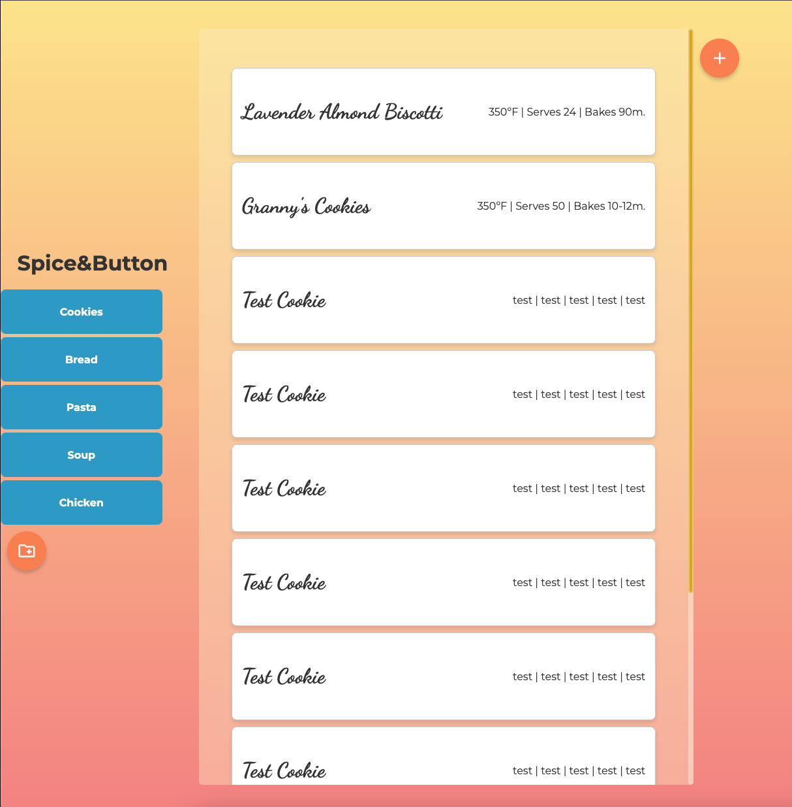

# SD 6100: JavaScript Web App: Spice & Button

# Recipe Manager Application

## Purpose

The Recipe Manager Application is a dynamic web-based tool for organizing, managing, and displaying recipes. It allows users to create new recipe categories, add recipes to those categories, and view detailed information about each recipe. The app fetches data from a JSON-based API and allows users to modify the data, which is automatically updated in real-time.

## Features

### 1. **Dynamic Recipe Categories and Tabs**
- Recipe categories are displayed as tabs. Each tab corresponds to a specific recipe category (e.g., "Cookies", "Bread").
- Clicking a tab loads the recipes within that category.
  
### 2. **View Recipe Details**
- Each recipe is displayed as a card with the recipe name and highlights.
- Clicking on a recipe card opens a modal with detailed information including:
  - **Recipe Name**
  - **Highlights**
  - **Ingredients**
  - **Directions**
  - **Notes**
  - **Creation Date**

### 3. **Add New Recipes**
- Users can add new recipes by filling out a form with the following fields:
  - **Recipe Category**
  - **Recipe Name**
  - **Highlights** (e.g., oven temperature, prep time)
  - **Ingredients**
  - **Directions**
  - **Notes**
  
- New recipes are added to the selected category, and the data is sent to the server via an API request, updating the stored data.

### 4. **Create New Categories**
- Users can create new recipe categories by specifying a category name.
- Newly created categories are saved and displayed as tabs in the application.

### 5. **Modal Views**
- The application uses modals for:
  - Viewing recipe details.
  - Adding new recipes.
  - Creating new categories.

- Modals include overlays and can be dismissed by clicking outside the modal or pressing the "Escape" key.

## Technologies

- **HTML**: Used to structure the page, including forms, buttons, and modals.
- **CSS**: Applied for styling, ensuring the app is responsive and visually appealing.
- **JavaScript**: Used to dynamically populate the page, interact with the JSON Bin API, and manage user actions such as adding recipes and categories.
- **JSON Bin API**: A remote JSON storage service used to store and fetch recipe data.

## How It Works

1. **Fetching Data**: 
   On page load, the app fetches the recipe data (including categories and recipes) from a remote JSON Bin endpoint. This data is then used to populate the recipe categories and display them as tabs.

2. **Displaying Recipes**: 
   When a user clicks on a tab, the corresponding recipes are displayed as cards. Clicking on a card opens a modal with detailed recipe information.

3. **Adding Recipes**: 
   To add a new recipe, users select a category, fill out a form with the recipe details, and click "Create Recipe". The recipe data is then added to the JSON Bin and the page is updated.

4. **Creating Categories**: 
   Users can create new recipe categories by entering a category name and clicking "Create Tab". The new category is then added to the list of available tabs.

5. **Saving and Updating Data**: 
   All changes, including new recipes and categories, are saved back to the JSON Bin using a PUT request, ensuring the data is persistent.

## Screenshots

## Future Improvements

- **Error Handling**: Implement more comprehensive error handling for fetch requests to improve user experience in case of network failures.
- **Form Validation**: Enhance form validation to ensure that all required fields are *correctly* filled out before submission.
- **Inline Editing**: Allow users to edit existing recipes and categories directly within the application.
- **Mobile Optimization**: Improve responsiveness and mobile-friendly features to enhance usability on smaller screens.
